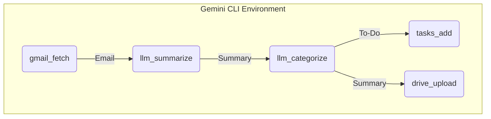

# Rx LLM Proc: Gemini CLI Extensions for Google Workspace

Rx LLM Proc provides a powerful framework to scale LLM evaluations across
personal and professional data. While its current implementation is centered on
**Google Workspace** (Gmail, Sheets, Docs, Drive, Tasks), the library's
architecture is designed to be extensible to other platforms and ecosystems in
the future.

It enables you to process and react to daily work information through three main
modes of operation: as **extensions for the Gemini CLI**, through **long-running
reactive pipelines**, and via **modular command-line tools** for scripting and
automation.

## Core Concept: From Standalone Tools to Gemini CLI Skills

Originally conceived as a standalone toolchain, the components of Rx LLM Proc
are ideally suited to be integrated as extensions or skills within the Gemini
CLI. This provides a more cohesive and powerful user experience, combining
Gemini's core capabilities with deep integration into your office applications.

The goal is to solve problems like this directly from your command line:

> I want to get all of my recent Emails
>
> - Categorize emails by content and extract todos using an LLM
> - Send a summary to myself by category
> - Add new todos to Google Tasks

This is achieved by providing a collection of tools that can be chained together
to create sophisticated data pipelines.



For more use cases, see [GoalAndMotivation](docs/GoalAndMotivation.md).

## Three Modes of Operation

Rx LLM Proc is designed to be used in three distinct but complementary ways:

1.  **Skills for the Gemini CLI**: Integrate directly with the Gemini CLI to
    provide it with the "skills" needed to access and process your Google
    Workspace data (Gmail, Drive, Sheets, Tasks) through natural language.
2.  **Long-Running Reactive Pipelines**: Use the underlying Python framework
    (powered by [RxPy](https://rxpy.readthedocs.io/)) to build event-driven
    systems that continuously monitor and react to incoming information, such as
    processing every new email as it arrives.
3.  **Modular Scripting & Automation**: Use the provided command-line tools as
    modular components in traditional shell scripts or dependency-based build
    systems like [GNU Make](https://www.gnu.org/software/make/) for robust,
    repeatable data processing.

## Gemini CLI Skills

This project includes specialized skills for the Gemini CLI to automate Google
Workspace workflows.

**Prerequisite**: Ensure the `rxllmproc` package is installed in your
environment so the CLI tools are available on your PATH:

```bash
pip install .
```

To enable the skills, link the `gemini/skills` directory to your workspace:

```bash
gemini skills link gemini/skills --scope workspace
```

After linking, reload your skills in an interactive Gemini session:

- `/skills reload`

The available skills are:

- **`workspace-orchestrator`**: Cross-service automation (e.g., Gmail to
  Sheets/Drive).
- **`document-architect`**: AI guided & markdown-based GDocs modification.
- **`knowledge-synthesizer`**: Cross-service research and information
  extraction.

## How is this different from a standard LLM CLI?

While a tool like the Gemini CLI is powerful for single, direct interactions
with an LLM, Rx LLM Proc is a **modular framework** designed to solve a broader
class of problems:

- **Direct Google Workspace Integration**: Rx LLM Proc comes with built-in
  connectors for Gmail, Drive, Sheets, and Tasks, handling the complexities of
  authentication and data retrieval automatically.
- **Workflow and Pipeline Orchestration**: It allows you to chain actions
  together (e.g., fetch email -> summarize -> categorize -> save to Sheet) into
  sophisticated data pipelines, rather than performing isolated actions.
- **Built-in Data Processing Utilities**: It includes specialized tools for
  prompt templating, cleaning data (like HTML to Markdown conversion), and
  handling structured JSON output, providing a "batteries-included" experience
  for building workspace automation.

## Core Capabilities

By integrating this project as a Gemini CLI extension, you gain several key
capabilities:

- **Direct Google Workspace Integration**: Directly fetch, process, and manage
  data from Gmail, Drive, Sheets, and Tasks within the CLI, without needing to
  manually copy-paste data.

- **Automated Workflow Orchestration**: The provided tools are designed to be
  chained together, allowing you to build complex data pipelines that pass
  information from one step to the next.

- **"Batteries-Included" Utilities**: The framework provides essential tools
  that surround the core LLM call, including prompt templating and robust
  handling of structured data like JSON.

- **Reactive Stream Processing**: For advanced use cases, the underlying Python
  framework uses [RxPy](https://github.com/ReactiveX/RxPY) to create
  continuously running jobs that can react to new data, such as incoming emails.

## Available Tools & Integrations

This package provides a range of tools that can be exposed as skills within the
Gemini CLI.

<div style="border-width: 0.5px; border-style: solid; border-color: red; padding: 1em">
<p>NOTE: Rx LLM Proc only provides building blocks/steps and example applications that provide access to APIs and use AI generated output. Make 
sure you read the sections on <a href="#privacy">Privacy</a> and 
<a href="#using-ai-models">Using AI models</a> below to ensure your safety.
</p>
</div>

### Google Workspace APIs:

- **GMail: Fetching messages**\
  Retrieve emails matching a specific query.
  - Related Docs: [GmailCLI](docs/cli/GmailCLI.md)
- **GDrive: Download/upload files**\
  Download or upload/update a document by name or ID.
  - Related Docs: [GdriveCLI](docs/cli/GdriveCLI.md)
- **Tasks: Fetching & Managing tasks**\
  Retrieve all Google Tasks or tasks from a specific list. (Future: Create new
  tasks).
  - Related Docs: [TasksCLI](docs/cli/TasksCLI.md)
- **Sheets: Fetching Sheets data**\
  Retrieve data from a Google Sheet (whole sheets or specific ranges).
  - Related Docs: [SheetsCLI](docs/cli/SheetsCLI.md)

### Core & Utility APIs:

- **LLM (Gen AI/Gemini): Evaluation**\
  Evaluate a text prompt to obtain a text answer, with robust JSON support.
  - Related Docs: [LlmCLI](docs/cli/LlmCLI.md)
- **Template Rendering: Render Jinja2 templates**\
  Dynamically generate LLM prompts from multiple inputs.
  - Related Docs: [TemplateCLI](docs/cli/TemplateCLI.md)
- **Data Transformation**: Convert HTML to clean markdown, aggregate items into
  lists, and filter data based on specific conditions.

## Design

- [Overview](docs/design/Overview.md)

## Privacy

Rx LLM Proc allows access to multiple APIs. It is completely in the
user/developer's responsibility how these tools are assembled and set up to
retrieve and send information, including private information.

**NOTE**:

- Tools that use APIs may retrieve any and all personal information accessible
  via the provided credentials.
- Combining these tools may result in sending personal information to other
  APIs, including Gemini.
- To avoid repeated authentication, Credentials are
  [stored](docs/cli/CommandLineCredentialsManagement.md) in the local file
  system. It is the user's responsibility to sufficiently protect these files.

## Using AI models

Some tools in Rx LLM Proc generate output based on AI models.

**NOTE**:

- While it's the goal for LLMs to produce useful content, they are not
  infallible. Do **never** assume the information is correct or act on the
  information without verifying it.
- As model-generated information may get passed on to other processing steps, it
  is also necessary to verify these indirect results.

## License

Apache 2.0; see [LICENSE](LICENSE) for details.

## Disclaimer

This project is not an official Google project. It is not supported by Google
and Google specifically disclaims all warranties as to its quality,
merchantability, or fitness for a particular purpose.
