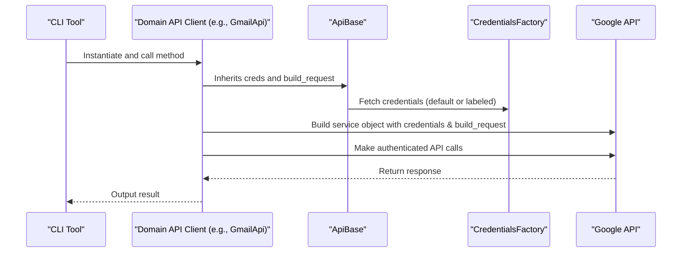

# API Integration Design

## Introduction

A primary function of the `Rx LLM Proc` library is to interact with external web
services, particularly Google Workspace APIs (like Gmail, Drive) and the Gemini
API. This document outlines the design pattern used to ensure these integrations
are consistent and maintainable.

The design is centered on a common base class, `ApiBase`, and a centralized
authentication provider, `CredentialsFactory`.

## Core Component: `ApiBase`

All specific API clients in the framework inherit from a common base class:
`rxllmproc.core.api_base.ApiBase`.

The key responsibilities of `ApiBase` are:

1.  **Credential Management**: It ensures that a credential object is available. It can either take a specific credential or fetch the default one from `CredentialsFactory`.
2.  **Request Customization**: It provides a `build_request` method that ensures
    all HTTP requests made by the Google API client are authenticated and
    handled consistently.

## Concrete Implementation: Domain API Clients

For each service, a concrete API client is implemented in its respective domain
package. For example, the `rxllmproc/gmail/` package contains `api.py`.

The concrete class is responsible for:

1.  Inheriting from `ApiBase`.
2.  Initializing the Google API service object (e.g., using `build()`).
3.  Managing the lifecycle and thread-safety of the service object (typically using `threading.local()`).
4.  Implementing methods that map to the external service's API endpoints.

### Implementation Pattern

```python
# In rxllmproc/core/api_base.py
class ApiBase:
    def __init__(self, creds: auth.Credentials | None = None):
        self._creds = creds or auth.CredentialsFactory.shared_instance().get_default()

    def build_request(self, http, *args, **kwargs):
        # Wraps the HTTP transport with authentication.
        ...

# In a domain api.py
from rxllmproc.core.api_base import ApiBase
from googleapiclient.discovery import build

class GmailApi(api_base.ApiBase):
    def __init__(self, creds=None, service=None):
        super().__init__(creds)
        self._service_arg = service
        self._local = threading.local()

    @property
    def _service(self):
        """Lazily builds the authenticated Google API service object per thread."""
        if self._service_arg:
            return self._service_arg
        if not hasattr(self._local, 'service'):
            self._local.service = build(
                "gmail", "v1", credentials=self._creds,
                requestBuilder=self.build_request
            )
        return self._local.service
```

## Authentication Flow

The authentication process is managed centrally via `CredentialsFactory`.



For more details on how credentials are obtained and stored, see
[[CredentialStoreDesign]].

## Benefits of this Design

- **Decoupling**: Business logic doesn't need to know *how* authentication is performed; it just uses the authenticated client.
- **Consistency**: All Google API clients use the same `ApiBase` and `build_request` pattern.
- **Thread Safety**: Using `threading.local()` for the service object ensures that the same client can be safely used in multi-threaded environments (like `RxPy` pipelines).
- **Testability**: Domain API clients can easily be mocked or instantiated with a fake service object during unit tests.
