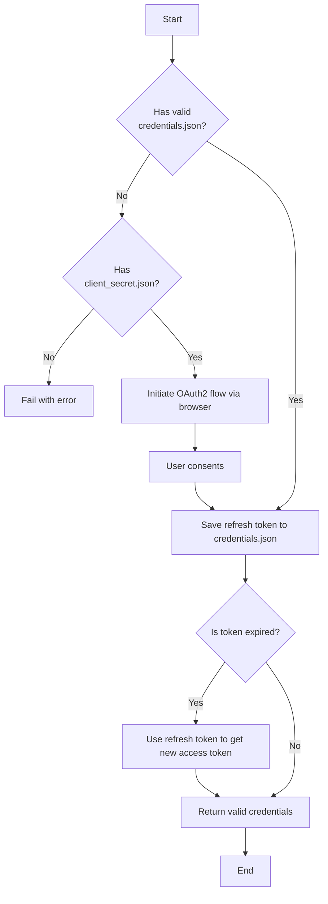

# Credential Storage Design

## Introduction

Secure and persistent handling of user credentials is a critical requirement for a library that interacts with personal data in Google Workspace. This document outlines the design for how `Rx LLM Proc` authenticates with Google services, focusing on how credentials are obtained, stored, and reused.

The entire authentication process is managed by a central component, `rxllmproc.core.auth.CredentialsFactory`.

## The `CredentialsFactory` Component

`CredentialsFactory` is the central provider for authentication credentials. Any component in the system that needs to make an authenticated API call requests credentials from this factory.

Key methods include:
- `get_default()`: Fetches the primary OAuth2 credentials for the current user.
- `for_label(label)`: Fetches specific credentials (e.g., service accounts) identified by a unique label.

The factory uses a chain of **credential providers** (factories) to attempt to satisfy the request:
1. **ADC (Application Default Credentials)**: Checks if the standard Google Cloud environment provides a valid identity.
2. **Default OAuth Provider**: Uses local `client_secret.json` and `credentials.json` files for the "Installed Application" flow.
3. **Service Account Provider**: Looks for JSON keys in a pre-configured `service_accounts/` directory.

## The OAuth2 Authentication Flow

The standard "Installed Application" flow is used when no ADC or service account is provided.

### First-Time Authentication

When a user runs a command for the first time:

1.  A component (e.g., `GmailApi`) requests credentials from `CredentialsFactory`.
2.  The factory checks for a locally stored `credentials.json` file. If the file doesn't exist or is invalid, it proceeds.
3.  It locates the `client_secret.json` file, which must be provided by the user (or set via `RX_LLM_PROC_GOOGLE_CLIENT_SECRET_FILE`).
4.  Using the secret file, the factory initiates an OAuth2 authorization flow. It prompts the user to grant permission in their browser.
5.  After the user grants consent, the factory receives a token and a **refresh token**.
6.  These are saved into the `credentials.json` file (or set via `RX_LLM_PROC_GOOGLE_CREDENTIALS_FILE`).
7.  The authenticated credential object is returned.



### Subsequent Authentications

1.  `CredentialsFactory` loads the stored `credentials.json`.
2.  If the access token is expired, it transparently uses the **refresh token** to get a new one from Google.
3.  The updated token is saved back to `credentials.json`.
4.  The valid credentials are returned.

## File Storage and Security

*   **`client_secret.json`**: Contains the application's OAuth2 client ID and secret.
*   **`credentials.json`**: Contains the user's access and refresh tokens. **This file is highly sensitive.** Anyone with access to this file can gain access to the user's authorized Google services.

### SECURITY WARNING

It is the **user's responsibility** to ensure the security of the directory containing these files. On Unix-like systems, set strict permissions:

```bash
# Example: Make the credentials file readable/writable only by the current user
chmod 600 credentials.json
```

## Environment Variables

Locations of these files can be overridden using environment variables:
- `RX_LLM_PROC_GOOGLE_CLIENT_SECRET_FILE`
- `RX_LLM_PROC_GOOGLE_CREDENTIALS_FILE`
- `RX_LLM_PROC_GOOGLE_SERVICE_ACCOUNTS_DIR`
