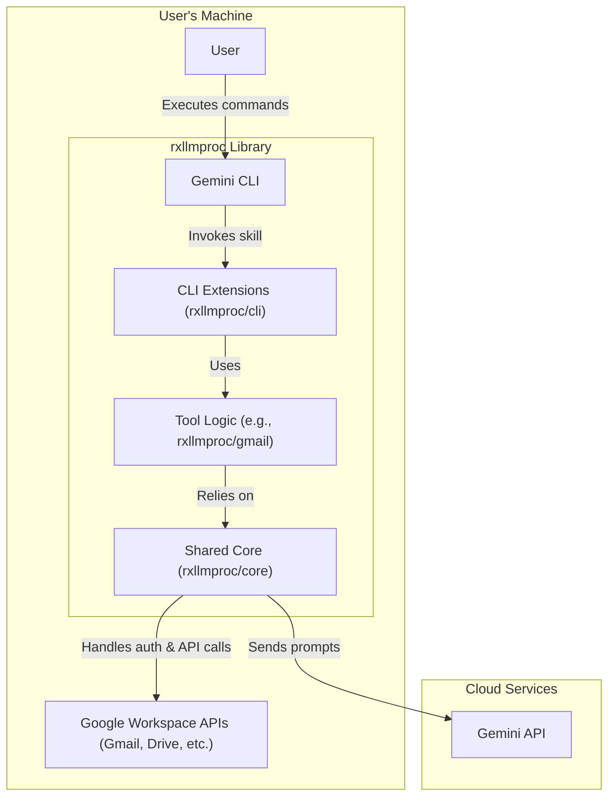

# Design Overview

## Introduction

This document provides a high-level architectural overview of the `Rx LLM Proc`
(`rxllmproc`) project. The project is designed as a library of tools and
components to simplify the application of Large Language Models (LLMs) to data
from Google Workspace.

While the components can be used as a standalone Python SDK, the primary and
intended use case is to provide a rich set of **extensions and skills for the
Gemini CLI**. This allows users to create powerful, automated workflows directly
in their command-line environment.

## Core Principles & Rationale

The architecture follows a **Domain-Driven Design (DDD)** approach, emphasizing:

1.  **Modular, Composable Tools**: The project is a collection of distinct,
    self-contained tools (e.g., `gmail`, `gdrive`) that can be chained together.
    This ensures **high cohesion** and **low coupling**, as changes to one
    domain have minimal impact on others.
2.  **Shared Core Services**: All tools rely on a shared `core` module for
    authentication, credential management, and base API clients. This prevents
    duplication and ensures **centralized consistency**.
3.  **Clear Ownership & Scalability**: Grouping code by feature domain makes
    responsibility obvious and simplifies adding new services (e.g., Google
    Calendar) by following established patterns.
4.  **Dual Consumption Models**:
    -   **CLI Extensions**: Primary focus; thin wrappers for Gemini CLI integration.
    -   **Python SDK**: Advanced use; utilizes [RxPy](https://github.com/ReactiveX/RxPY)
        for reactive, asynchronous stream processing.

## High-Level Architecture

## Key Components

The `rxllmproc/` root package is organized to reflect its modular design:

- **`core/`**: Foundational services (auth, API bases). See [[CredentialStoreDesign]], [[ApiIntegrationDesign]], and [[RxOperatorApproach]].
- **`cli/`**: Presentation layer; thin wrappers parsing arguments for the domain logic. See [[CommandLineToolDesign]].
- **`app/`**: High-level, end-to-end applications (e.g., [[MailCategorizerDesign]]).
- **`llm/`**: Domain package for LLM (Gemini) interaction and prompt management.
- **`docs/`**: Specialized package for Google Docs management. See [[DocsUpdaterDesign]] and [[LlmUpdaterDesign]].
- **`database/`**: Persistence abstractions using SQLAlchemy.
- **`text_processing/`**: Utilities for HTML/Markdown conversion and Jinja templating.
- **`plugins/`**: System for discovering and loading framework extensions. See [[PluginDesign]].

### Anatomy of a Domain Package

Each service-specific package (e.g., `rxllmproc/gmail/`) typically follows a standard structure:

- **`api.py`**: Low-level client for the service's REST API.
- **`operators.py`**: (Optional) High-level business logic and RxPy operators.
- **`types.py`**: Public Python data classes (domain objects).
- **`_interface.py`**: (Internal) Type definitions for raw API responses.

## Further Reading

For a deeper dive into specific parts of the architecture, please see the
following documents:

- [[ApiIntegrationDesign]]
- [[CommandLineToolDesign]]
- [[CredentialStoreDesign]]
- [[CachingDesign]]
- [[PluginDesign]]
- [[RxOperatorApproach]]
- [[MailCategorizerDesign]]
- [[DocsUpdaterDesign]]
- [[LlmUpdaterDesign]]
