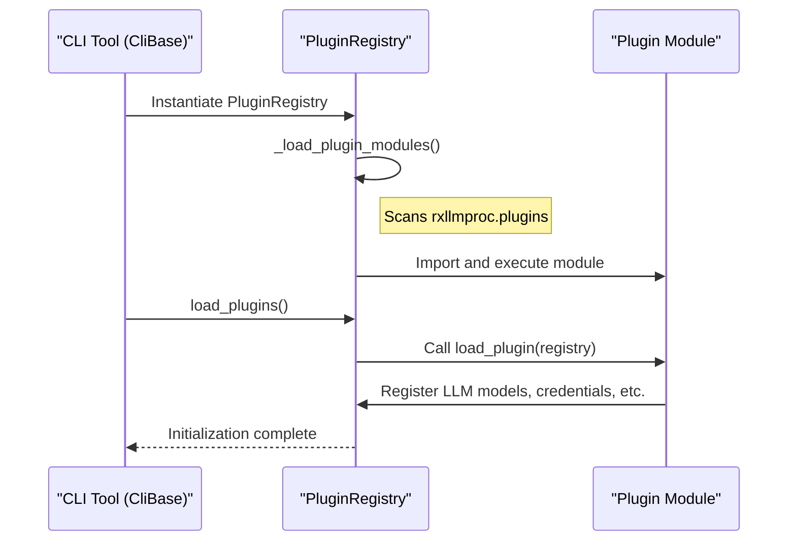

# Plugin System Design

## Introduction

To allow for flexible extension without modifying the core codebase, `Rx LLM Proc` includes a plugin system. This system enables developers to add new functionality, such as new LLM models, authentication providers, or CLI options.

## Core Mechanism: Namespace Discovery

The plugin system is built on Python's `pkgutil.walk_packages` mechanism. `rxllmproc` automatically looks for sub-modules in the `rxllmproc.plugins` namespace.

The plugin loading logic is located in `rxllmproc/plugins/loader.py`.

## The Plugin Loading Process

The process is managed by `PluginRegistry`.

1.  **Discovery**: When a CLI tool starts, the `PluginRegistry` is instantiated. It scans the `rxllmproc.plugins` directory (and any other configured paths) for Python modules.
2.  **Import & Module Execution**: For each discovered plugin module, the registry imports it and executes its top-level code.
3.  **Registration Hook**: After all modules are imported, the registry calls a `load_plugin(registry)` function if it exists in any of the imported modules. This function is the primary hook for plugins to register their functionality.



## How to Create a Plugin

Creating a plugin involves adding a Python module to the `rxllmproc/plugins/` directory or a sub-directory.

### Implementation: `my_plugin.py`

A plugin module typically includes a `load_plugin` function.

**Example: Adding a New LLM Model Wrapper**
```python
# In rxllmproc/plugins/my_custom_llm.py

def load_plugin(registry):
    """
    Called by rxllmproc's PluginRegistry during startup.
    """
    # Register a new LLM model factory
    registry.llm_registry.set('my-cool-model', my_model_factory)
    
    # Optionally add custom CLI arguments via registry.argparse_instance
    if registry.argparse_instance:
        registry.argparse_instance.add_argument(
            '--custom-flag', help='Added by custom plugin'
        )

def my_model_factory(**kwargs):
    """A factory function that returns an LlmBase instance."""
    return MyCustomLlmWrapper(**kwargs)
```

## Available Registry Hooks

The `PluginRegistry` provides access to several core components:

*   **`llm_registry`**: An instance of `LlmModelFactory`, used to add new model implementations.
*   **`cred_store`**: An instance of `CredentialsFactory`, used to add new authentication methods or specific credentials.
*   **`argparse_instance`**: The main `argparse.ArgumentParser` being used by the CLI tool, allowing plugins to add their own flags.
*   **`make_action_to_store`**: A helper to create `argparse` actions that store results directly into specific configuration objects.

## Benefits of this Design

*   **Modular Architecture**: New features can be developed as isolated modules.
*   **Minimal Boilerplate**: Simply adding a file to the plugins directory is enough to activate it.
*   **Centralized Integration**: The `PluginRegistry` provides a single, controlled interface for extensions to interact with the core library.
